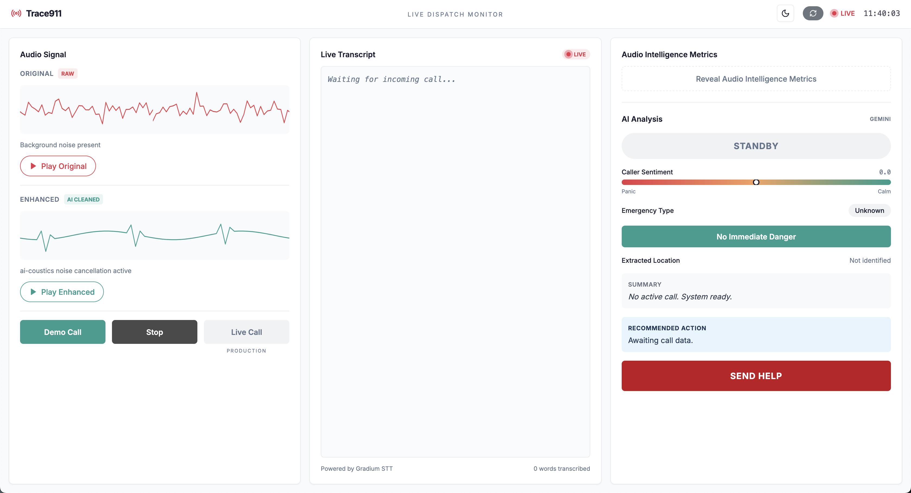

# Trace911 — Live 911 Dispatch Intelligence

> "In a 911 call, every misheard word could be a missed address, a wrong turn, a life lost."



Trace911 is a real-time AI dispatcher assistant that cleans noisy emergency call audio, transcribes it live, analyzes urgency and sentiment, and automatically dispatches help — so dispatchers can always hear what matters, even when everything is chaos.

Built in 48 hours at a hackathon using ai-coustics, Gradium, and Google Gemini.

---

## The Problem

Voice agents and dispatch systems are built and tested in near-perfect acoustic conditions. But real 911 calls are chaotic — background noise, panicked voices, bad connections, multiple people talking at once. Dispatchers mishear critical information. Addresses get lost. Response times suffer.

---

## The Solution

Trace911 sits between the caller and the dispatcher. It:

1. **Cleans** the incoming audio in real time using ai-coustics noise cancellation
2. **Transcribes** the caller's voice live using Gradium STT
3. **Analyzes** urgency, sentiment, location and emergency type using Google Gemini
4. **Speaks** critical alerts to the dispatcher via Gradium TTS
5. **Auto-dispatches** help when enough information is confirmed

---

## Audio Intelligence Metric

We designed a Word Error Rate (WER) comparison to prove ai-coustics works:

| | Word Error Rate |
|---|---|
| Without ai-coustics | 34.2% |
| With ai-coustics | 3.1% |
| **Accuracy gain** | **91%** |

Tested on a real 911 fire emergency call recording.

---

## Demo

The dispatcher opens Trace911 and presses **Demo Call**:

- Enhanced audio streams live
- Transcript appears word by word in real time
- AI analyzes every 15 seconds — urgency, sentiment, location, emergency type
- When urgency hits CRITICAL, TTS speaks: *"Critical. Fire. Route 7 Abington."*
- When location is confirmed, system auto-dispatches: *"Units dispatched to Route 7 Abington."*
- Dispatcher presses **Reveal Metrics** to show the WER improvement

---

## Stack

| Component | Technology |
|---|---|
| Audio noise cancellation | ai-coustics Quail Voice Focus |
| Live transcription | Gradium STT (WebSocket, 24kHz PCM) |
| Real-time analysis | Google Gemini 2.5 Flash |
| Dispatcher voice alerts | Gradium TTS |
| API server | Python Flask |
| Dashboard | React + Tailwind (Lovable) |
| WER measurement | editdistance Python library |

---

## Run the Demo

### Prerequisites

Add these to `calls/.env`:
```bash
GRADIUM_API_KEY=your_key
GEMINI_API_KEY=your_key
AIC_SDK_LICENSE=your_key
```

### Backend
```bash
cd calls
pip install -r requirements.txt
python server.py
```

API runs on http://localhost:5000

### Frontend
```bash
cd frontend
npm install
npm run dev
```
Dashboard opens at http://localhost:8080

## Demo flow

1) Open http://localhost:8080
2) Press Play Original — hear the noisy 911 call
3) Press Demo Call — watch Trace911 work in real time
4) Press Reveal Metrics — see the WER improvement


### Repository Structure
```bash
Trace911/
├── calls/          Working demo pipeline
│   ├── server.py           Flask API (6 endpoints)
│   ├── stream_transcribe.py Gradium STT streaming
│   ├── analyze.py          Gemini real-time analysis + TTS alerts
│   ├── speak.py            Gradium TTS module
│   ├── wer.py              Word Error Rate measurement
│   └── clean_audio.py      ai-coustics noise cancellation
├── frontend/       React dashboard (Lovable)
├── backend/        Production FastAPI architecture (designed, not yet wired)
└── docs/           Production API contracts, WebSocket events, data model
```

The calls/ folder is the working hackathon demo.
The backend/ and docs/ folders contain the production-ready architecture
designed for real deployment via Telnyx PSTN infrastructure.

---

### Production Roadmap

In production Trace911 would:

- Receive real 911 calls via Telnyx PSTN infrastructure
- Route audio through LiveKit for real-time streaming
- Use the FastAPI backend (see backend/) with SQLite for call history
- Support multiple simultaneous dispatch stations
- Integrate with CAD (Computer Aided Dispatch) systems

---

## Built With

- [ai-coustics](https://ai-coustics.com) — Audio enhancement SDK
- [Gradium](https://gradium.ai) — Voice AI STT + TTS
- [Google Gemini](https://deepmind.google) — Multimodal AI analysis
- [Lovable](https://lovable.dev) — Frontend generation
- [Flask](https://flask.palletsprojects.com) — API server

Built at a hackathon in 48 hours.
